# Data Scraping Initiation and Processing Flow

This Mermaid diagram illustrates the detailed workflow for initiating and processing car data scraping tasks within the AutoScraper backend.

```mermaid
graph TD
    %% Define Styles
    classDef userAction fill:#99ccff,stroke:#333,stroke-width:2px,color:#000;
    classDef flaskRoute fill:#ccffcc,stroke:#333,stroke-width:2px,color:#000;
    classDef celeryTask fill:#ffebcc,stroke:#333,stroke-width:2px,color:#000;
    classDef coreModule fill:#e6ccff,stroke:#333,stroke-width:2px,color:#000;
    classDef externalSystem fill:#ffcccc,stroke:#333,stroke-width:2px,color:#000;
    classDef firebase fill:#fff2cc,stroke:#333,stroke-width:2px,color:#000;
    classDef utilModule fill:#ddeeff,stroke:#333,stroke-width:2px,color:#000;
    classDef errorState fill:#ff9999,stroke:#cc0000,stroke-width:2px,color:#000;

    %% User Action
    UA1["User Submits Search Payload via UI"]:::userAction

    %% Flask Route (API Results Blueprint)
    FR_FetchData["api_results.py: /api/fetch_data (POST)"]:::flaskRoute
    FR_FetchData_Func["fetch_data_api(payload)"]:::flaskRoute
    FR_FetchData_Error["Return 402: Insufficient Tokens"]:::errorState

    %% Auth Decorator
    AuthDecorator["auth_decorator.py: @login_required"]:::utilModule

    %% AutoScraper Module
    AS_Module["AutoScraper.py"]:::coreModule
    AS_FetchInitial["fetch_autotrader_data(payload, initial_fetch_only=True)"]:::coreModule
    AS_FetchFull["fetch_autotrader_data(payload, start_page, initial_results_html, max_page_override, task_instance)"]:::coreModule
    AS_ProcessLinks["process_links_and_update_cache(data, transformed_exclusions, max_workers, task_instance)"]:::coreModule
    AS_ExtractInfo["extract_vehicle_info(url)"]:::coreModule
    AS_WriteLocalCSV["Save Processed Results to Local CSV"]:::coreModule

    %% AutoScraperUtil Module
    ASU_Module["AutoScraperUtil.py"]:::utilModule
    ASU_ParseHTML["parse_html_content(html_content, raw_exclusions)"]:::utilModule
    ASU_RemoveDupes["remove_duplicates_exclusions(arr, excl)"]:::utilModule
    ASU_FormatTime["format_time_ymd_hms(seconds)"]:::utilModule
    ASU_GetProxy["get_proxy_from_file()"]:::utilModule

    %% Firebase Config Module
    FB_Config["firebase_config.py"]:::firebase
    FB_GetUserSettings["get_user_settings(user_id)"]:::firebase
    FB_SaveResults["save_results(user_id, results_list, metadata)"]:::firebase
    FB_DeductTokens["deduct_search_tokens(user_id, tokens_to_deduct)"]:::firebase

    %% Celery Task Module
    Celery_Tasks["tasks.py"]:::celeryTask
    Celery_ScrapeTask["scrape_and_process_task(payload, user_id, required_tokens, initial_scrape_data)"]:::celeryTask
    Celery_UpdateProgress["update_progress(current, total, step)"]:::celeryTask

    %% External Systems
    Ext_AutoTrader["AutoTrader.ca API"]:::externalSystem
    Ext_FirebaseDB["Firebase Firestore"]:::externalSystem
    Ext_CeleryWorker["Celery Worker Process"]:::externalSystem
    Ext_Redis["Redis (Celery Broker/Backend)"]:::externalSystem
    Ext_FileSystem["Local File System (Cache/Results)"]:::externalSystem

    %% Connections
    UA1 -- "HTTP POST /api/fetch_data (JSON payload)" --> FR_FetchData
    FR_FetchData -- "invokes" --> AuthDecorator
    AuthDecorator -- "populates g.user_id, g.user_settings" --> FR_FetchData_Func

    FR_FetchData_Func -- "1. Get user_settings from g" --> FB_GetUserSettings
    FB_GetUserSettings -- "reads user document" --> Ext_FirebaseDB
    FB_GetUserSettings -- "returns {search_tokens, can_use_ai}" --> FR_FetchData_Func

    FR_FetchData_Func -- "2. Perform Initial Fetch" --> AS_FetchInitial
    AS_FetchInitial -- "HTTP POST (page 0 request)" --> Ext_AutoTrader
    AS_FetchInitial -- "parses AdsHtml using" --> ASU_ParseHTML
    AS_FetchInitial -- "returns {estimated_count, initial_results_html, max_page}" --> FR_FetchData_Func

    FR_FetchData_Func -- "3. Calculate required_tokens (based on estimated_count)" --> FR_FetchData_Func
    FR_FetchData_Func -- "4. Check token balance (current_tokens vs required_tokens)" --> FR_FetchData_Func
    FR_FetchData_Func -- "IF insufficient tokens" --> FR_FetchData_Error

    FR_FetchData_Func -- "5. IF sufficient tokens, dispatch task" --> Celery_ScrapeTask
    Celery_ScrapeTask -- "dispatched via .delay()" --> Ext_Redis
    Ext_Redis -- "schedules task" --> Ext_CeleryWorker

    Ext_CeleryWorker -- "executes" --> Celery_ScrapeTask
    Celery_ScrapeTask -- "periodically calls" --> Celery_UpdateProgress
    Celery_UpdateProgress -- "updates task state" --> Ext_Redis

    Celery_ScrapeTask -- "Step 1: Full Data Fetch" --> AS_FetchFull
    AS_FetchFull -- "HTTP POST (multiple pages concurrently)" --> Ext_AutoTrader
    AS_FetchFull -- "parses AdsHtml using" --> ASU_ParseHTML
    AS_FetchFull -- "removes duplicates using" --> ASU_RemoveDupes
    AS_FetchFull -- "returns all_results_html (list of dicts)" --> Celery_ScrapeTask

    Celery_ScrapeTask -- "Step 2: Process Links & Update Cache" --> AS_ProcessLinks
    AS_ProcessLinks -- "loads cache via load_cache()" --> Ext_FileSystem
    AS_ProcessLinks -- "concurrently calls for new/stale links" --> AS_ExtractInfo
    AS_ExtractInfo -- "HTTP GET (individual listing)" --> Ext_AutoTrader
    AS_ProcessLinks -- "writes updated cache via write_cache()" --> Ext_FileSystem
    AS_ProcessLinks -- "returns processed_results_dicts" --> Celery_ScrapeTask

    Celery_ScrapeTask -- "Step 3: Save to Local CSV File" --> AS_WriteLocalCSV
    AS_WriteLocalCSV -- "generates timestamped filename using" --> ASU_FormatTime
    AS_WriteLocalCSV -- "writes CSV to" --> Ext_FileSystem

    Celery_ScrapeTask -- "Step 4: Save Results to Firebase" --> FB_SaveResults
    FB_SaveResults -- "writes metadata & listings (subcollection)" --> Ext_FirebaseDB

    Celery_ScrapeTask -- "Step 5: Deduct Tokens" --> FB_DeductTokens
    FB_DeductTokens -- "atomically updates tokens in" --> Ext_FirebaseDB

    Celery_ScrapeTask -- "Step 6: Return Final Result" --> Ext_Redis
```



---

# AutoScraper System Use Cases

This Mermaid use-case diagram outlines the primary actors and their interactions with the AutoScraper system.

```mermaid
left to right direction
actor "Registered User" as User
actor "System Administrator" as Admin
actor "Celery Worker" as CeleryWorker
actor "External Services" as ExtAPI

rectangle "AutoScraper System" {
  usecase "Manage Account (Login, Logout, Register)" as UC_Auth
  usecase "Define Search Payload (UI)" as UC_DefinePayload
  usecase "Save/Load Search Payloads" as UC_ManagePayloads
  usecase "Initiate Car Data Scrape" as UC_InitiateScrape
  usecase "View Scrape Progress" as UC_ViewProgress
  usecase "View Scraped Results" as UC_ViewResults
  usecase "Manage Scraped Results (Rename, Delete)" as UC_ManageResults
  usecase "Open Result Links in Browser" as UC_OpenLinks
  usecase "Request AI Car Analysis" as UC_AIAnalysis
  usecase "Perform Background Scraping" as UC_BackgroundScrape
  usecase "Process & Cache Data" as UC_ProcessCache
  usecase "Store/Retrieve User Data" as UC_FirebaseUser
  usecase "Store/Retrieve Payloads" as UC_FirebasePayloads
  usecase "Store/Retrieve Results" as UC_FirebaseResults
  usecase "Deduct Search Tokens" as UC_DeductTokens
  usecase "Fetch Car Data from AutoTrader" as UC_FetchAutoTrader
  usecase "Fetch Context from Google Search" as UC_FetchGoogleSearch
  usecase "Fetch Exchange Rates" as UC_FetchExchangeRates
  usecase "Generate AI Analysis (Gemini)" as UC_GenerateAI
  usecase "Manage User Settings (Tokens, AI Access)" as UC_AdminSettings
}

User -- UC_Auth
User -- UC_DefinePayload
User -- UC_ManagePayloads
User -- UC_InitiateScrape
User -- UC_ViewProgress
User -- UC_ViewResults
User -- UC_ManageResults
User -- UC_OpenLinks
User -- UC_AIAnalysis

Admin -- UC_AdminSettings
Admin -- UC_Auth

UC_InitiateScrape ..> UC_DeductTokens : include
UC_InitiateScrape ..> UC_BackgroundScrape : triggers
UC_BackgroundScrape ..> UC_ProcessCache : include
UC_ProcessCache ..> UC_FetchAutoTrader : include
UC_ProcessCache ..> UC_FirebaseResults : include (save)
UC_ProcessCache ..> UC_FirebaseUser : include (update cache date)

UC_AIAnalysis ..> UC_FetchGoogleSearch : include
UC_AIAnalysis ..> UC_FetchExchangeRates : include
UC_AIAnalysis ..> UC_GenerateAI : include

UC_ManagePayloads ..> UC_FirebasePayloads : include
UC_ViewResults ..> UC_FirebaseResults : include (load)
UC_ManageResults ..> UC_FirebaseResults : include (update/delete)

CeleryWorker -- UC_BackgroundScrape
CeleryWorker -- UC_ProcessCache

ExtAPI -- UC_FetchAutoTrader
ExtAPI -- UC_FetchGoogleSearch
ExtAPI -- UC_FetchExchangeRates
ExtAPI -- UC_GenerateAI

UC_AdminSettings ..> UC_FirebaseUser : include
